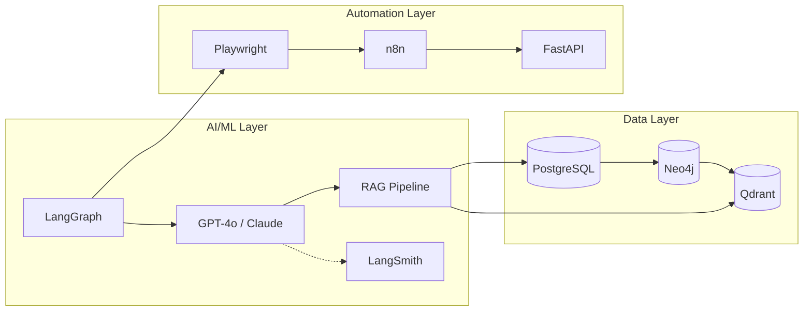

# 🧠 Kaan's Tech Stack Hub

> Production-grade knowledge repository for AI/ML systems, data engineering, and automation at scale.

---

## 🌟 Featured Projects

| Project | Stack | Description |
|---------|-------|-------------|
| [**Multi-Agent Research**](./99-blueprints/multi-agent-research) | LangGraph, Tavily, MCP | Supervisor-Worker architecture for deep research with citation tracking |
| [**Autonomous Browser Agent**](./99-blueprints/autonomous-browser-agent) | LangGraph, Playwright, GPT-4o | LLM-powered agent that navigates web autonomously via DOM analysis |
| [**Legal RAG & Knowledge Graph**](./99-blueprints/legal-rag-graphdb) | Neo4j, Qdrant, PyMuPDF | Hybrid search system for legal documents with citation support |
| [**Geospatial Data Pipeline**](./99-blueprints/geospatial-pipeline) | PostGIS, GDAL, Dask | Large-scale geospatial ETL with real-time visualization |

---

## 🔧 Core Competencies

```
┌─────────────────────────────────────────────────────────────────────────┐
│  🤖 LLM AGENTS        │  📊 DATA ENGINEERING    │  ⚡ AUTOMATION        │
│  ─────────────────    │  ──────────────────     │  ────────────         │
│  • LangChain/Graph    │  • ETL at Scale         │  • Browser Control    │
│  • RAG Systems        │  • Geospatial Analysis  │  • n8n Workflows      │
│  • Multi-Agent        │  • Vector & Graph DBs   │  • Event-Driven       │
└─────────────────────────────────────────────────────────────────────────┘
```

---

## 📁 Repository Structure

```
knowledge_base/
│
├── 1-architecture-patterns/     # Clean Code, SOLID, System Design
│   ├── clean-architecture/
│   ├── clean-code/
│   ├── design-patterns/
│   ├── system-design/
│   └── algorithms/
│
├── 2-data-engineering/          # ETL, Scraping, Geospatial
│   ├── etl-pipelines/
│   ├── document-processing/     📄 PDF, OCR, Tables
│   ├── geospatial-analysis/     ⭐ Differentiator
│   ├── db-optimization/
│   └── architecture/
│
├── 3-ai-ml/                     # LLMs, RAG, Computer Vision
│   ├── llm-agents/              ⭐ Flagship (Multi-Agent, MCP)
│   ├── rag-systems/             ⭐ Flagship
│   ├── observability/           🔍 LangSmith, RAGAS
│   ├── computer-vision/
│   └── ml-ops/
│
├── 4-automation/                # Browser, n8n, Event-Driven
│   ├── browser-automation/
│   ├── n8n-workflows/
│   └── event-driven/
│
├── 5-python-advanced/           # Concurrency, Testing, Patterns
│   ├── web-frameworks/
│   ├── data-stack/
│   └── testing/
│
├── 6-databases/                 # Vector, Graph, Postgres
│   ├── vector-dbs/
│   ├── graph-dbs/
│   └── postgres-advanced/
│
├── 7-infrastructure/            # Docker, AWS Serverless
│   ├── docker/
│   └── aws-serverless/          🚀 API Gateway, Mangum, SAM
│
└── 99-blueprints/               🏆 Production Architectures
    ├── autonomous-browser-agent/
    ├── multi-agent-research/    ⭐ New (Supervisor Pattern)
    ├── legal-rag-graphdb/
    ├── geospatial-pipeline/
    ├── scalable-scraping/
    └── data-pipelines/
```

---

### 5. Python - İleri Seviye

- **[Nesne Yönelimli Programlama (OOP)](./5-python-advanced/OOP/overview.md)**
  - **Tamamlandı:** [Bölüm 1: Sınıflar ve Nesneler](./5-python-advanced/OOP/1-class_and_object/class_and_object.md) - Python nesne modelinin `__new__`, descriptor'lar, metaclass'ler ve dataclass'ler gibi temel yapı taşları incelendi.

---

## 🚀 Quick Navigation

### By Use Case

| I want to... | Go to |
|--------------|-------|
| Build an LLM Agent | [llm-agents](./3-ai-ml/llm-agents) → [browser-agent blueprint](./99-blueprints/autonomous-browser-agent) |
| Implement RAG | [rag-systems](./3-ai-ml/rag-systems) → [legal-rag blueprint](./99-blueprints/legal-rag-graphdb) |
| Scrape at Scale | [etl-pipelines](./2-data-engineering/etl-pipelines) → [scalable-scraping blueprint](./99-blueprints/scalable-scraping) |
| Work with Geo Data | [geospatial-analysis](./2-data-engineering/geospatial-analysis) |
| Choose a Vector DB | [vector-dbs](./6-databases/vector-dbs) |
| Dockerize Production | [docker](./7-infrastructure/docker) |

---

## 📊 Tech Stack Overview



---

## 📝 License

This repository is for personal reference and portfolio purposes.

---

*Last updated: 2025-12-12*
- Build pipelines that feed AI systems reliably
- Deploy ML models with production-grade observability
- Automate human-in-the-loop workflows intelligently

---

## 7. Real-World Usage

### Scenario 1: Building an Autonomous Legal Document Analyzer

**Problem:** Law firm needs to process 10K+ contracts monthly, extract key clauses, and flag risks.

**How this repo helps:**

| Step | Reference |
|------|-----------|
| Document ingestion | `2-data-engineering/etl-pipelines/` |
| PDF parsing | `5-python-ecosystem/pdf-processing/` |
| Text chunking & embedding | `3-ai-and-agents/rag-systems/` |
| Vector storage | `6-databases/vector/` |
| Agent for Q&A | `3-ai-and-agents/llm-agents/` |
| Production deployment | `7-devops-cloud/containerization/` |

**Time saved:** Instead of 2 weeks of research, I have battle-tested patterns in 2 hours.

---

### Scenario 2: Scalable Web Scraping for Market Intelligence

**Problem:** E-commerce client needs competitor pricing from 500+ websites, daily.

**How this repo helps:**

| Step | Reference |
|------|-----------|
| Static scraping patterns | `2-data-engineering/etl-pipelines/scraping-tools/beautifulsoup/` |
| Dynamic JS rendering | `4-automation-workflows/browser-automation/playwright/` |
| Anti-detection strategies | `99-blueprints-and-recipes/scalable-scraping-architecture/` |
| Pipeline orchestration | `2-data-engineering/etl-pipelines/pipeline-patterns/` |
| Data storage design | `6-databases/relational/` |

**Outcome:** Deployed in 1 week. Runs reliably at 100K pages/day.

---

### Scenario 3: Internal Knowledge Bot for Engineering Team

**Problem:** Engineering team drowning in Confluence, Notion, and Slack. "Where is X documented?" kills productivity.

**How this repo helps:**

| Step | Reference |
|------|-----------|
| Multi-source ingestion | `2-data-engineering/etl-pipelines/` |
| Embedding pipeline | `3-ai-and-agents/rag-systems/` |
| Conversational agent | `3-ai-and-agents/llm-agents/` |
| Slack integration | `4-automation-workflows/event-driven-systems/` |
| Deployment | `7-devops-cloud/aws-serverless/` |

**Impact:** 40% reduction in "context-switching" interruptions. Engineers find answers in seconds.

---

## Quick Reference

### Getting Started

```bash
# Clone and explore
cd knowledge_base

# Each folder is self-contained
# Start with your current problem, not from the beginning
```

### Navigation Tips

1. **Have a specific problem?** → Go directly to the relevant folder
2. **Building something new?** → Check `99-blueprints-and-recipes/` first
3. **Learning a concept?** → Start from `0-foundations/` and follow dependencies

### Philosophy Reminder

```
┌────────────────────────────────────────┐
│  "Don't collect knowledge.             │
│   Build systems that leverage it."     │
│                                        │
│                    — Engineering Ethos │
└────────────────────────────────────────┘
```

---

*This document is a living artifact. It evolves with every production lesson learned.*
